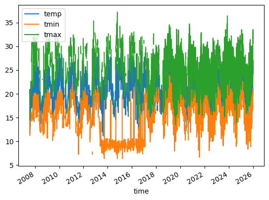
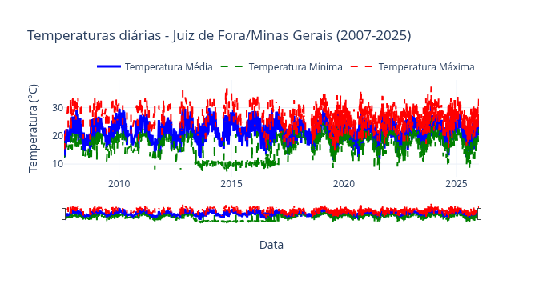

# Análise de dados metereológicos com Meteostat

O **Meteostat** é um pacote Python que reúne dados meteorológicos e climáticos de organizações públicas em um único conjunto abrangente, disponibilizado sob a licença *Creative Commons Attribution 4.0 International (CC BY 4.0)*.

**Meteostat** utiliza um modelo *freemium* para sua **API**, que consiste em um plano gratuito com um limite fixo de 500 requisições por mês. Para cotas maiores, escolha um plano pago.

Para extrair a série histórica e visualizar os dados metereológicos, adotamos os seguintes procedimentos:

### Importamos os pacotes


```python
from datetime import date
import matplotlib.pyplot as plt
import meteostat as ms
```

### Definimos a localização

O *objeto* **POINT** identifica um ponto geográfico específico.


```python
POINT = ms.Point(-21.762661, -43.365703, 850)
```

### Definimos o período da série temporal

A **API JSON** exige um intervalo de tempo especificado com os parâmetros START (início) e END (fim). Para esses parâmetros, forneça sempre as datas no formato AAAA-MM-DD.<br>


```python
START = date(2007, 7, 1)
END = date(2025, 12, 31)
```

### Definimos as estações

Podem ser capturados dados de uma estações metereológica específica, através de identificador exclusivo, ou das estações próximas a uma determinada coordenada geográfica.


```python
stations = ms.stations.nearby(POINT, limit=4)
```

### Extraímos os dados

As séries temporais podem ser extraídas em diferentes intervalos de tempo disponíveis: dia, hora e mês. A série diária é ideal para identificar padrões em períodos longos, tais como semanas, meses ou anos. O prazo máximo para intervalos diários é de 30 anos.


```python
ts = ms.daily(stations, START, END)
```

### Definimos o dataframe

O método de *interpolação* é utilizado para estimar dados meteorológicos em pontos geográficos específicos com base em estações meteorológicas próximas.


```python
df = ms.interpolate(ts, POINT).fetch()
```

### Exploramos o dataframe


```python
print(df.head())
```

                temp  tmin  tmax  rhum  prcp  wspd  pres  cldc
    time                                                      
    2007-07-24  20.0  17.1  29.6  <NA>   1.0  <NA>  <NA>  <NA>
    2007-07-25  20.9  17.2  <NA>  <NA>   0.0  <NA>  <NA>  <NA>
    2007-07-27  13.6  11.2  20.0  <NA>   2.0  <NA>  <NA>  <NA>
    2007-07-28  13.3  12.1  15.6  <NA>   2.0  <NA>  <NA>  <NA>
    2007-07-29  11.6  <NA>  14.4  <NA>   0.0  <NA>  <NA>  <NA>


```python
df.info()
```

    <class 'pandas.core.frame.DataFrame'>
    DatetimeIndex: 4775 entries, 2007-07-24 to 2025-12-31
    Data columns (total 8 columns):
     #   Column  Non-Null Count  Dtype  
    ---  ------  --------------  -----  
     0   temp    4775 non-null   Float64
     1   tmin    4246 non-null   Float64
     2   tmax    3660 non-null   Float64
     3   rhum    3330 non-null   UInt8  
     4   prcp    3375 non-null   Float64
     5   wspd    3329 non-null   Float64
     6   pres    3326 non-null   Float64
     7   cldc    1240 non-null   UInt8  
    dtypes: Float64(6), UInt8(2)
    memory usage: 307.8 KB


### Listamos as estações


```python
print(stations)
```

                               name country region  latitude  longitude  \
    id                                                                    
    86851  Juiz De Fora / São Pedro      BR     MG  -21.7700   -43.3642   
    83692              Juiz De Fora      BR     MG  -21.7667   -43.3500   
    
           elevation           timezone  distance  
    id                                             
    86851        950  America/Sao_Paulo     830.7  
    83692        939  America/Sao_Paulo    1682.7  


### Visualizamos a série histórica

O pacote **Meteostat** possui uma função personalizada para visualização gráfica, que recebe parâmetros específicos de acordo com a granularidade dos dados.


```python
df.plot(y=[ms.Parameter.TEMP, ms.Parameter.TMIN, ms.Parameter.TMAX])
plt.show()
```


### Definimos uma função

A função a seguir realiza a plotagem de temperaturas históricas para um município específico. Ela utiliza a **API** *Nominatim* (do **Geopy**) para *geocodificação*, convertendo o nome do local em coordenadas geográficas e altitude para criar um objeto *Point* do **Meteostat**. Para criar um gráfico interativo, utiliza o pacote **Plotly**, ao invés da biblioteca padrão.


```python
from datetime import date
import meteostat as ms
import plotly.graph_objects as go
from geopy.geocoders import Nominatim
import requests

def plot_temperatures_city(city_name, state=None, country='Brazil', 
                           start_date=None, end_date=None, 
                           title_suffix="", show_plot=True,
                           verbose=True):
    """
    Plota temperaturas diárias de uma cidade específica.
    
    Parâmetros:
    -----------
    city_name : str
        Nome da cidade (ex: "Juiz de Fora")
    state : str, opcional
        Nome do estado/província (ex: "Minas Gerais")
    country : str, opcional
        Nome do país (padrão: "Brazil")
    start_date : datetime.date, opcional
        Data inicial (padrão: 01/07/2007)
    end_date : datetime.date, opcional
        Data final (padrão: 31/12/2025)
    title_suffix : str, opcional
        Texto adicional para o título do gráfico
    show_plot : bool, opcional
        Se True, mostra o gráfico (padrão: True)
    verbose : bool, opcional
        Se True, exibe mensagens de progresso (padrão: True)
        
    Retorna:
    --------
    tuple: (fig, df, point)
        fig: objeto Figure do Plotly
        df: DataFrame com os dados
        point: objeto Point do Meteostat com coordenadas
    """
    
    def get_city_point(city_name, state, country):
        """Função interna para obter coordenadas da cidade"""
        geolocator = Nominatim(user_agent="temperature_app_v1.0")
        
        # Construir query
        query_parts = [city_name]
        if state:
            query_parts.append(state)
        if country:
            query_parts.append(country)
        
        query = ", ".join(query_parts)
        
        location = geolocator.geocode(query)
        
        if not location:
            raise ValueError(f"Cidade não encontrada: {query}")
        
        # Obter altitude aproximada
        try:
            response = requests.get(
                f"https://api.open-elevation.com/api/v1/lookup",
                params={'locations': f"{location.latitude},{location.longitude}"},
                timeout=5
            )
            elevation = response.json()['results'][0]['elevation']
        except:
            elevation = 0  # Valor padrão
        
        return ms.Point(location.latitude, location.longitude, elevation)
    
    # Definir datas padrão se não fornecidas
    if start_date is None:
        start_date = date(2007, 7, 1)
    if end_date is None:
        end_date = date(2025, 12, 31)
    
    # Obter coordenadas
    if verbose:
        print(f"Obtendo coordenadas para {city_name}...")
    POINT = get_city_point(city_name, state, country)
    if verbose:
        print(f"Coordenadas encontradas: Lat={POINT.latitude}, Lon={POINT.longitude}m")
    
    # Obter estações meteorológicas próximas
    if verbose:
        print("Buscando estações meteorológicas próximas...")
    stations = ms.stations.nearby(POINT, limit=4)
    
    # Obter dados diários
    if verbose:
        print(f"Coletando dados de {start_date} a {end_date}...")
    ts = ms.daily(stations, start_date, end_date)
    df = ms.interpolate(ts, POINT).fetch().reset_index()
    
    # Verificar se há dados
    if df.empty:
        raise ValueError(f"Nenhum dado encontrado para {city_name} no período especificado")
    
    if verbose:
        print(f"Dados coletados: {len(df)} registros de {df['time'].min().date()} a {df['time'].max().date()}")
    
    # Criar gráfico (mesmo se não for mostrar, retornamos o objeto)
    fig = go.Figure()
    
    colors = {'temp': 'blue', 'tmin': 'green', 'tmax': 'red'}
    names = {'temp': 'Média', 'tmin': 'Mínima', 'tmax': 'Máxima'}
    
    for col in ['temp', 'tmin', 'tmax']:
        if col in df.columns:
            fig.add_trace(go.Scatter(
                x=df['time'],
                y=df[col],
                mode='lines',
                name=f'Temperatura {names[col]}',
                line=dict(color=colors[col], 
                         width=3 if col == 'temp' else 2,
                         dash='solid' if col == 'temp' else 'dash'),
                hovertemplate=f'Data: %{{x|%d/%m/%Y}}<br>Temp. {names[col]}: %{{y:.1f}}°C<extra></extra>'
            ))
    
    # Construir título
    title = f'Temperaturas diárias - {city_name}'
    if state:
        title += f'/{state}'
    title += f' ({start_date.year}-{end_date.year})'
    if title_suffix:
        title += f' - {title_suffix}'
    
    fig.update_layout(
        title=title,
        xaxis_title='Data',
        yaxis_title='Temperatura (°C)',
        hovermode='x unified',
        template='plotly_white',
        legend=dict(
            orientation="h",
            yanchor="bottom",
            y=1.02,
            xanchor="right",
            x=1
        ),
        xaxis=dict(
            rangeslider=dict(visible=True),
            type="date"
        )
    )
    
    if show_plot:
        if verbose:
            print("Exibindo gráfico...")
        fig.show()
        if verbose:
            print("Gráfico exibido com sucesso!")
    else:
        if verbose:
            print("Gráfico criado (não exibido conforme solicitado).")
    
    if verbose:
        print("Processo concluído!")
    
    return fig, df, POINT

```

### Chamamos a função

Como principais parâmetros, a função *plot_temperatures* recebe o nome do município, a unidade da federação e o país para definir a localização exata da consulta.


```python
fig, df, point = plot_temperatures_city(
    "Juiz de Fora", 
    "Minas Gerais",
    start_date=date(2007, 7, 1),
    end_date=date(2025, 12, 31),
    show_plot=False,
    verbose=True 
)
```

    Obtendo coordenadas para Juiz de Fora...
    Coordenadas encontradas: Lat=-21.7609533, Lon=-43.3501129m
    Buscando estações meteorológicas próximas...
    Coletando dados de 2007-07-01 a 2025-12-31...
    Dados coletados: 4775 registros de 2007-07-24 a 2025-12-31
    Exibindo gráfico...



    Gráfico exibido com sucesso!
    Processo concluído!


### Análise básica dos dados


```python
print(f"Período: {df['time'].min().date()} a {df['time'].max().date()}")
print(f"Média temperatura máxima: {df['tmax'].mean():.1f}°C")
print(f"Média temperatura mínima: {df['tmin'].mean():.1f}°C")
    
tmax_max = df['tmax'].max()
tmax_max_dates = df.loc[df['tmax'] == tmax_max, 'time'].dt.date.tolist()
print(f"Temperatura máxima absoluta: {tmax_max:.1f}°C \
(ocorreu em: {', '.join(str(d) for d in tmax_max_dates)})")
    
tmin_min = df['tmin'].min()
tmin_min_dates = df.loc[df['tmin'] == tmin_min, 'time'].dt.date.tolist() 
print(f"Temperatura mínima absoluta: {tmin_min:.1f}°C \
(ocorreu em: {', '.join(str(d) for d in tmin_min_dates)})")
```

    Período: 2007-07-24 a 2025-12-31
    Média temperatura máxima: 26.5°C
    Média temperatura mínima: 17.0°C
    Temperatura máxima absoluta: 38.1°C (ocorreu em: 2014-10-20)
    Temperatura mínima absoluta: 7.2°C (ocorreu em: 2013-09-17, 2014-10-20, 2015-03-21)


**Considerações finais:**

O gráfico mensal mostra que, entre 2013 e 2017, diversos episódios de queda acentuada de temperatura ocorreram em Juiz de Fora, sobretudo durante o outono, o inverno e, ocasionalmente, em setembro, normalmente associados à passagem de frentes frias e à atuação de massa de ar polar.


**Fontes:**

[Meteostat](https://meteostat.net/pt/) e provedores.

**Referências:**

Isaia, Daniel. *Massa polar derruba temperaturas em grande parte do território brasileiro*. Brasília, DF,26 abr 2016. Disponível em: https://agenciabrasil.ebc.com.br/geral/noticia/2016-04/massa-polar-derruba-temperaturas-em-grande-parte-do-territorio-brasileiro. Último acesso em: 04/02/2026.

LAMPRECHT, Christian Sebastian. Meteostat Python. Versão 1.2.0. 2022. Software. Disponível em: https://pypi.org/project/meteostat/. Último acesso em: 04/02/2026.

UOL. *Mais intensa massa de ar polar dos últimos anos avança pelo Brasil no final de semana*. São Paulo, 19 jul. 2013. Disponível em: https://noticias.uol.com.br/meio-ambiente/ultimas-noticias/redacao/2013/07/19/mais-intensa-massa-de-ar-polar-dos-ultimos-anos-avanca-pelo-brasil-no-final-de-semana.htm. Último acesso em: 04/02/2026.

TRIBUNA DE MINAS. *Frente fria deixa céu nublado e tempo instável*. Juiz de Fora, 17 jul. 2017. Disponível em: https://tribunademinas.com.br/noticias/cidade/17-07-2017/frente-fria-deixa-ceu-nublado-e-tempo-instavel.html. Último acesso em: 04/02/2026.

VALENTE, Eduardo. *Frio em JF bate recorde com 8,1 graus*. Juiz de Fora, 24 jul. 2013. Disponível em: https://tribunademinas.com.br/noticias/cidade/24-07-2013/frio-em-jf-bate-recorde-com-81-graus.html. Último acesso em: 04/02/20526.

VALENTE, Eduardo. *JF registra a menor temperatura máxima desde 2014*. Juiz de Fora, MG, 19 jul 2014. Disponível em: https://tribunademinas.com.br/noticias/cidade/19-07-2017/frio-se-intensifica-em-juiz-de-fora.html. Último acesso em: 04/02/2026.


